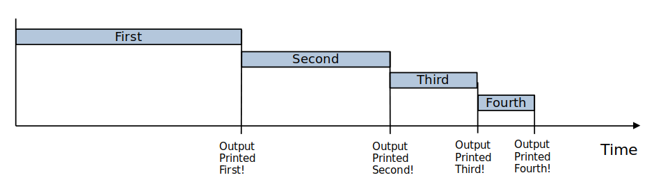
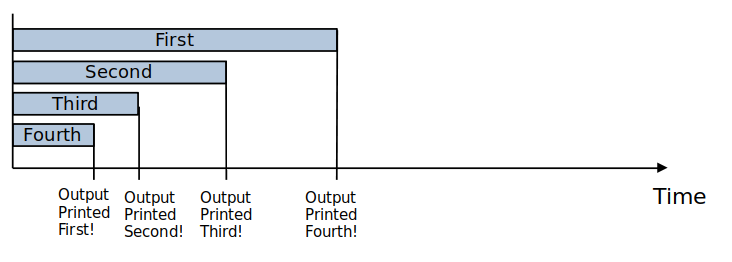

## Question-1

Contains a form which generates a preview of a credit card. Users can enter their name, card number, card expiration date, and security number here.

A Visa/Mastercard logo will appear according to the first digit of the entered number (4 for Visa, 5 for Mastercard).

Each field has its limit of the maximum characters that can be entered, (16 characters for name and card number, 4 characters for expiration date).

_Note: Validation for fields are currently **not** implemented, so 20/90 for date field will not raise any warnings_

### Getting started

Open `question-1/index.html` in browser

## Question-2

Contains a Node.js script to demonstrate the difference between asynchronouse parallel and series executions.

<code>
// Pseudocode

delay(2000 seconds, "Executed after 2s");
delay(1000 seconds, "Executed after 1s");
delay(500 seconds, "Executed after 0.5s");
delay(100 seconds, "Executed after 0.1s");
</code>

### Serial Execution

Graph to illustrate their timings

As expected:

- the first output is printed 2s after the program was ran,
- the second output is printed 1s after the first has finished running,
- the third output is printed 0.5s after the second has finished running,
- the fourth output is printed 0.5s after the third has finished running.

### Parallel Execution

Graph to illustrate their timings

Although all four instructions are executed synchronously (i.e. all are executed in order), they **don't wait for the previous one to finished running to start**.

### Getting started

_Make sure you have [node](https://nodejs.org/en/download/) installed first on your computer_

Run `node question-2/script.js`.
